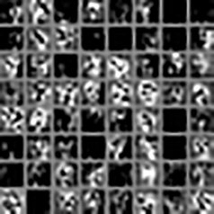

# tf-cnn-image

Tensorflow のチュートリアルである Deep MNIST for Experts の畳み込み層とプーリング層のデータを画像化します。

コードの解説は[「畳み込み層とプーリング層を画像表示してみるてすと - Qiita」](http://qiita.com/akiraak/items/870173a361a59f1e88bb)にあります。
## 環境構築

+ Python3.5を使用する
+ Tensorflow, Pillow をインストールする
+ <https://github.com/tensorflow/tensorflow> をルートに配置する（画像を読み込むために tensorflow/tensorflow/examples/tutorials/mnist/input_data.py を使用します。）

## 実行

```
$ python 3.py
```

iamges/ に画像ファイルが作られます。

### 第一畳み込み層

学習前

学習後


### 第一プーリング層

学習前

学習後


### 第二畳み込み層

学習前

学習後


### 第二プーリング層

学習前

学習後

